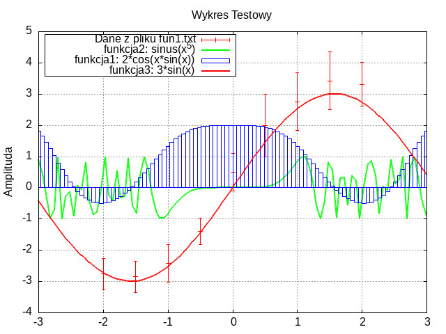
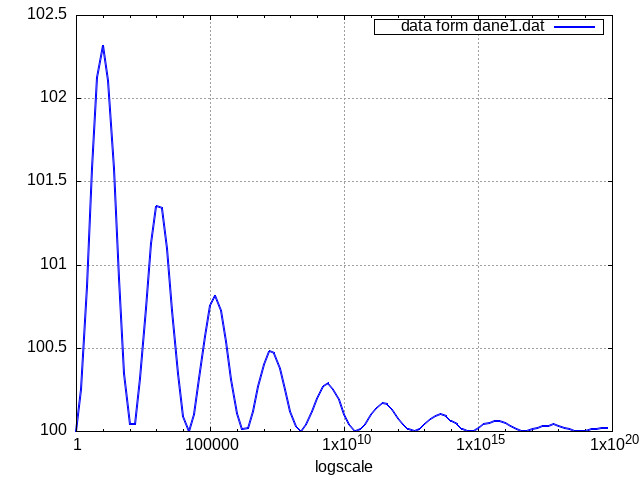
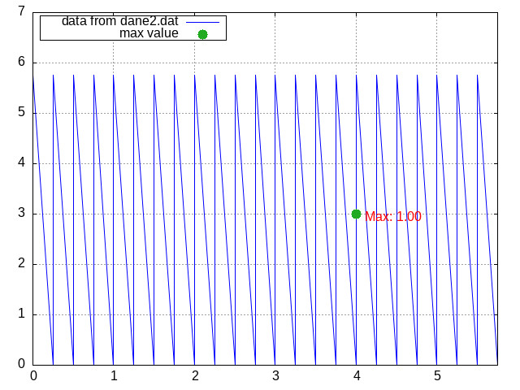

# Sprawozdanie

**Nr laboratorium:** 2
**Temat:** Reprezentacja liczb zmiennoprzecinkowych i wizualizacja danych (GSL & Gnuplot)
**Autor:** Vladyslav Humeniuk
**Data:** 15.11.2025

-----

## 1. Co było do zrobienia

Celem zajęć było zapoznanie się z biblioteką GSL (GNU Scientific Library) do analizy binarnej reprezentacji liczb zmiennoprzecinkowych oraz nauką tworzenia zaawansowanych wykresów przy użyciu narzędzia Gnuplot.


### Zadanie
- Potrzebne pliki
    - Wzorcowy Makefile
    - dokladnosc.c
- Proszę skompilować program dokladnosc.c przy użyciu polecenia make, a następnie uruchomić go.
- Korzystając z funkcji gsl_ieee_printf_double zobaczyć, jak zmienia się mantysa i cecha dla coraz mniejszych liczb. Kiedy mantysa nie jest w postaci znormalizowanej?


### Zadania - gnuplot
- Prosze odtworzyc wykres znajdujacy sie na [rysunku](https://artemis.wszib.edu.pl/~funika/mois/lab2/testowy.png)
- Przy pomocy gnuplot prosze narysowac dane zgromadzone w pliku dane1.dat. Aby wykres byl czytelny, jedna z osi musi miec skale logarytmiczna. Prosze ustalic, ktora to os i narysowac wykres.
- Prosze narysowac wykres funkcji dwywymiarowej, ktorej punkty znajduja sie w pliku dane2.dat. Prosze przegladnac plik i sprobowac znalezc w nim maksimum. Potem prosze zlokalizowac maksimum wizualnie na wykresie. Prosze na wykresie zaznaczyc maksimum jako notke (np. set arrow).

-----

## 2. Reprezentacja liczb (GSL)

### 2.1. Kod z pliku [dokladnosc.c](dokladnosc.c)

Napisano program w języku C, który dzieli jedynkę przez kolejne liczby naturalne ($1/1, 1/2, \dots, 1/20$) i wyświetla ich binarną reprezentację IEEE 754 dla typów `float` i `double`.

```c
#include <stdio.h>
#include <gsl/gsl_ieee_utils.h>

int main (void)
{
  /* default was 1.0/3.0 for float and double */
  for (int i = 1; i <= 20; i++)
  {
    printf("i: %d\n", i);
    float x = 1.0;
    double xd = 1.0;
    float y = i;
    double yd = i;
    float f = 1.0/y;
    double d = 1.0/yd;
    double fd = f; /* promote from float to double */

    printf(" f="); gsl_ieee_printf_float(&f);
    printf("\n");
    printf("fd="); gsl_ieee_printf_double(&fd);
    printf("\n");
    printf(" d="); gsl_ieee_printf_double(&d);
    printf("\n");
  }

  return 0;
}
```

### 2.2. Wyniki i analiza

Przykładowy fragment wyjścia programu(wszystkie wyjścia programu w [out.txt](out.txt)):

```text
i: 1
 f= 1.00000000000000000000000*2^0
 d= 1.0000000000000000000000000000000000000000000000000000*2^0
...
i: 3
 f= 1.01010101010101010101011*2^-2
 d= 1.0101010101010101010101010101010101010101010101010101*2^-2
...
i: 20
 f= 1.10011001100110011001101*2^-5
 d= 1.1001100110011001100110011001100110011001100110011010*2^-5
```

**Obserwacje:**

1.  Wraz ze zmniejszaniem się wartości liczby ($1/i$), wykładnik (cecha) maleje (np. z $2^0$ do $2^{-5}$).
2.  Mantysa dla liczb niebędących potęgami dwójki (np. $1/3$) jest nieskończonym ułamkiem okresowym w systemie dwójkowym, co prowadzi do błędów zaokrągleń. Widać różnicę na ostatnich bitach między `float` (f) a `double` (d).

**Kiedy mantysa nie jest w postaci znormalizowanej?**
Liczby znormalizowane w standardzie IEEE 754 mają postać $1.mantysa \times 2^{cecha}$.
Liczby **zdenormalizowane** (subnormalne) pojawiają się, gdy wynik jest tak mały, że wykładnik osiąga swoją minimalną wartość, a "ukryta jedynka" na początku mantysy zmienia się w zero ($0.mantysa \times 2^{min\_cecha}$).
W przeprowadzonym eksperymencie (dla $i \in [1, 20]$) liczby są wciąż stosunkowo duże (najmniejsza to $0.05$), więc **wszystkie wyniki są znormalizowane** (zaczynają się od `1....`). Zdenormalizowane liczby dla `float` pojawiłyby się dopiero przy wartościach rzędu $10^{-38}$.

-----

## 3. Gnuplot

### Zadanie 1
kod z pliku [zadanie1.gp](zadanie1.gp):
```gnuplot
fun1(x) = 2*cos(x*sin(x))
fun2(x) = sin(x**5)
fun3(x) = 3*sin(x)
label0 = "Dane z pliku fun1.txt"
label1 = "funkcja1: 2*cos(x*sin(x))"
label2 = "funkcja2: sinus(x^5)"
label3 = "funkcja3: 3*sin(x)"
set output "zad1.jpeg"
set terminal jpeg
set grid
set title "Wykres Testowy"
set ylabel "Amplituda"
set label
set key box left width -1
set xrange [-3:3]
set yrange [-4:5]
plot "fun1.txt" using 1:($2+$3)/2:2:3 lw 1.5 lc rgb "red" w yerrorbars title label0, \
     fun2(x) lw 2 lc rgb "green" title label2, \
     fun1(x) lw 1 lc rgb "blue" with boxes title label1, \
     fun3(x) lw 2 lc rgb "red" title label3
```

**Wynik:**


-----

### Zadanie 2
Dane w pliku [dane1.dat](dane1.dat) zmieniały się wykładniczo. Aby wykres był czytelny, zastosowano skalę logarytmiczną na osi X.

kod z pliku [zadanie2.gp](zadanie2.gp):
```gnuplot
set output "zad2.jpeg"
set terminal jpeg

set logscale x
set grid

set xlabel "logscale"
label1 = "data form dane1.dat"
set label
set key box right

plot 'dane1.dat' axes x1y1 w lines lt 1 lw 2 lc rgb "blue" title label1
```

**Wynik:**


-----

### Zadanie 3
Najtrudniejszym elementem było automatyczne znalezienie współrzędnych $(x, y)$, dla których wartość w trzeciej kolumnie jest największa.

Wykorzystano komendę `stats` dwuetapowo:

1.  Znaleziono **indeks** (numer wiersza w [dane2.dat](dane2.dat)) maksymalnej wartości w 3. kolumnie.
2.  Pobrano wartości X i Y specyficzne dla tego wiersza przy pomocy `every`.

kod z pliku [zadanie3.gp](zadanie3.gp):

```gnuplot
set output "zad3.jpeg"
set terminal jpeg

set grid

# searching for max value and for index
stats 'dane2.dat' using 3 name "VAL"
# VAL_max       -> value (1.0)
# VAL_index_max -> index (396)

# X for this row
# "every ::Start::End" - taking only one row
stats 'dane2.dat' using 1 every ::VAL_index_max::VAL_index_max name "POS_X"
target_x = POS_X_min

# Y for this row
stats 'dane2.dat' using 2 every ::VAL_index_max::VAL_index_max name "POS_Y"
target_y = POS_Y_min

# output
print sprintf("Max Value: %f found at Index: %d", VAL_max, VAL_index_max)
print sprintf("Coordinates are X: %f, Y: %f", target_x, target_y)


stats 'dane2.dat' using 1 name "X_AXIS"
set xrange [X_AXIS_min:X_AXIS_max]
set yrange [0:7]

set style line 1 pointtype 7 linecolor rgb '#22aa22' pointsize 2

# labels
label1 = "data from dane2.dat"
label2 = "max value"
set label
set key box left

# https://stackoverflow.com/a/19457387
plot 'dane2.dat' using 1:2 axes x1y1 w lines lt 1 lw 1 lc rgb "blue" title label1, \
     '+' using ($0 == 0 ? target_x : NaN):(target_y):(sprintf('Max: %.2f', VAL_max)) \
     with labels offset char 1,-0.5 left textcolor rgb 'red' \
     point linestyle 1 title label2
```

**Wynik:**
Na wykresie poprawnie zaznaczono punkt, gdzie funkcja osiąga maksimum (wartość `1.0` w wierszu 396).


## 4. Wnioski

1. Analiza numeryczna: Użycie gsl_ieee_printf pozwala "zajrzeć pod maskę" liczb zmiennoprzecinkowych. Widać wyraźnie, że proste ułamki dziesiętne (jak 0.2, czyli 1/5) nie zawsze mają skończoną reprezentację binarną, co jest źródłem błędów numerycznych.

2. Automatyzacja w Gnuplot: Gnuplot to nie tylko narzędzie do rysowania, ale też prosty język skryptowy. Możliwość obliczania statystyk (stats) bezpośrednio na plikach danych pozwala tworzyć wykresy, które same "adaptują się" do danych (np. automatycznie znajdując i podpisując ekstrema), bez konieczności zewnętrznego przetwarzania danych w C czy Pythonie.

3. Wizualizacja: Dobór odpowiedniej skali (np. logarytmicznej) jest kluczowy dla czytelności danych o charakterze wykładniczym.

## 5. Bibliografia
[GNU Scientific Library — GSL 2.8 documentation](https://www.gnu.org/software/gsl/doc/html/index.html)
[Gnuplot](http://www.gnuplot.info/help.html)
